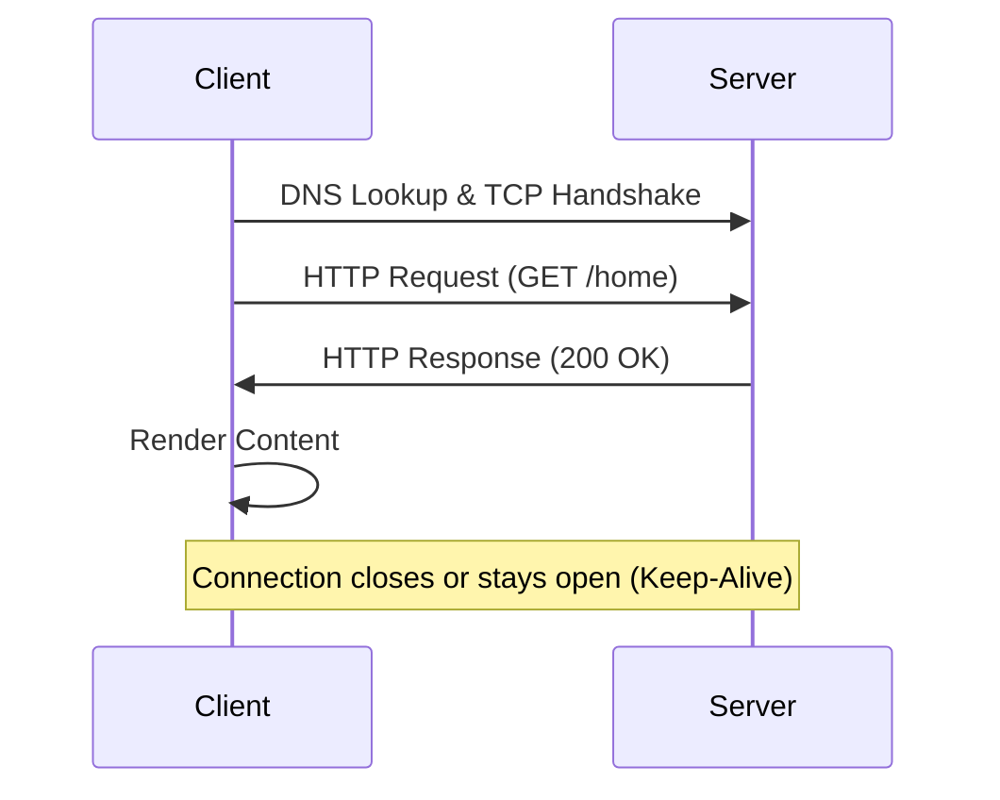

# Fundamentals of System Design 

---

### What is System Design?

**Answer:**

System Design is the process of defining the **architecture, components, and data flow** of a system to meet both **functional** and **non-functional** requirements (like scalability, reliability, and performance).

In simple terms, it’s about **creating the blueprint of a large-scale system** — how different parts (APIs, databases, services, caches, etc.) interact to serve millions of users efficiently.

**Key Components:**

1. **Functional Requirements** – What the system should do.
2. **Non-Functional Requirements** – How well it should perform (scalability, latency, fault tolerance).
3. **High-Level Design** – System architecture, data flow, service interactions.
4. **Low-Level Design** – Data models, algorithms, and detailed interactions between components.


---

### Why is System Design Important?

**Answer:**

System Design is important because it ensures that a system can **scale, perform, and remain reliable** as it grows. It helps engineers make the right **architectural decisions early**, preventing costly rework later.

**Key Reasons:**

1. **Scalability** – Handles increased user load efficiently.
2. **Reliability** – Ensures the system stays available even if parts fail.
3. **Performance** – Maintains low latency and fast response times.
4. **Maintainability** – Makes the system easier to update and debug.
5. **Cost Efficiency** – Optimizes infrastructure and operational costs.

---
## 1. Network & Communication

### Why Does Networking Matter in System Design?

**Answer:**

Networking is the **backbone of distributed systems** — every service-to-service call, API request, and database query relies on network communication. Understanding networking helps you design systems that are **fast, reliable, and fault-tolerant**.

**Key Reasons:**

1. **Service Communication** – Enables interaction between microservices, databases, and clients.
2. **Performance Optimization** – Helps reduce latency and bandwidth usage.
3. **Scalability** – Supports horizontal scaling using load balancers and distributed nodes.
4. **Fault Tolerance** – Proper network design avoids single points of failure.
5. **Security** – Ensures safe data transfer using encryption and secure protocols (HTTPS, TLS).

---

### How Does Networking Impact Large-Scale Systems?

**Answer:**

In large-scale systems, **networking directly affects performance, scalability, and reliability**. As the system grows, data must travel across multiple servers, regions, and services — making network efficiency critical.

**Key Impacts:**

1. **Latency** – Each network call adds delay; optimizing connections reduces response time.
2. **Bandwidth Usage** – Inefficient data transfer can slow down or overload the system.
3. **Scalability** – Proper network design (load balancers, CDNs, replication) enables horizontal scaling.
4. **Fault Tolerance** – Redundant paths and retries help handle node or region failures.
5. **Consistency** – Network delays can cause data synchronization issues across distributed nodes.
6. **Cost** – Cross-region data transfers and high bandwidth usage increase infrastructure costs.

---

## 🌐 Understanding of IP Address

---

### Introduction to IP Address

**Answer:**

An **IP (Internet Protocol) Address** is a unique identifier assigned to every device connected to a network. It allows devices (like servers, clients, routers) to **find and communicate** with each other over the internet or a local network.

**Key Points:**

1. **Purpose** – Identifies and locates devices in a network.
2. **Format** – Can be **IPv4** (e.g., `192.168.1.1`) or **IPv6** (e.g., `2001:0db8::1`).
3. **Types** –

   * **Public IP:** Used for communication over the internet.
   * **Private IP:** Used within internal/local networks.
4. **Static vs Dynamic:**

   * **Static IP** – Manually assigned, doesn’t change.
   * **Dynamic IP** – Assigned automatically by DHCP, can change over time.

---

### What is IPv4?

**Answer:**

**IPv4 (Internet Protocol version 4)** is the **fourth version** of the Internet Protocol and the most widely used system for identifying devices on a network. It uses a **32-bit address format**, allowing around **4.3 billion unique addresses**.

**Key Points:**

1. **Format:** Four numbers separated by dots (e.g., `192.168.1.1`).
2. **Address Range:** 0.0.0.0 to 255.255.255.255.
3. **Address Space:** ~4.3 billion addresses (2³²).
4. **Representation:** Each part (octet) ranges from 0–255.
5. **Limitation:** Due to internet growth, IPv4 addresses are running out — leading to **IPv6** adoption.

---

### What is IPv6?

**Answer:**

**IPv6 (Internet Protocol version 6)** is the **successor to IPv4**, developed to overcome the limitation of IPv4’s address exhaustion. It uses a **128-bit address format**, providing an almost unlimited number of unique IP addresses.

**Key Points:**

1. **Format:** Eight groups of four hexadecimal digits separated by colons (e.g., `2001:0db8:85a3:0000:0000:8a2e:0370:7334`).
2. **Address Space:** 2¹²⁸ possible addresses — enough for every device globally.
3. **Simplified Configuration:** Supports auto-configuration without DHCP.
4. **Security:** Built-in support for IPsec (encryption and authentication).
5. **Efficiency:** Improved routing and reduced network congestion compared to IPv4.

---

### Private vs Public IP Address

**Answer:**

**Private IP addresses** are used **within local networks** (like home, office, or internal company systems), while **Public IP addresses** are used to **communicate over the internet**.

| **Aspect**          | **Private IP**                                                                                  | **Public IP**                                 |
| ------------------- | ----------------------------------------------------------------------------------------------- | --------------------------------------------- |
| **Scope**           | Used within a local/private network                                                             | Used across the internet                      |
| **Access**          | Not directly accessible from the internet                                                       | Accessible globally                           |
| **Assigned By**     | Local network devices (e.g., router/DHCP)                                                       | Internet Service Provider (ISP)               |
| **Examples (IPv4)** | `10.0.0.0 – 10.255.255.255`<br>`172.16.0.0 – 172.31.255.255`<br>`192.168.0.0 – 192.168.255.255` | Any address not in the private IP ranges      |
| **Security**        | More secure, isolated from external access                                                      | Exposed to external traffic, needs protection |
| **Use Case**        | Home LANs, corporate intranets, internal servers                                                | Web servers, public APIs, cloud services      |

**In short:**
Private IP = for internal communication.
Public IP = for external (internet) communication.

---

### Why Do We Need Private IPs?

**Answer:**

Private IPs are essential for enabling **internal communication** within local networks **without consuming public IP addresses**. They help build secure, isolated environments for devices to connect and share resources efficiently.

**Key Reasons:**

1. **Address Conservation:** Reduces the need for public IPs, which are limited in IPv4.
2. **Internal Communication:** Allows devices (like laptops, printers, and servers) to connect within the same network.
3. **Security:** Keeps internal systems hidden from the public internet, reducing attack risks.
4. **Cost Efficiency:** No need for every device to have its own public IP.
5. **Network Flexibility:** Enables local routing, DHCP usage, and NAT (Network Address Translation).

**In short:**
Private IPs make internal networking **secure, scalable, and cost-effective** without exposing internal systems to the public web.

---

### The Role of IP in System Design

**Answer:**

IP (Internet Protocol) plays a fundamental role in system design by enabling **communication between different components** of a distributed system — servers, databases, load balancers, and clients — across networks.

**Key Roles:**

1. **Identification:** Each device or service in a network is uniquely identified by an IP address.
2. **Routing:** IP ensures that data packets reach the correct destination across local or global networks.
3. **Scalability:** Allows horizontal scaling by assigning unique IPs to new servers or microservices.
4. **Load Balancing:** Load balancers use IPs to route traffic to multiple backend servers.
5. **Security & Isolation:** Private IPs separate internal traffic from public exposure, improving security.
6. **High Availability:** Enables failover and redundancy through multiple IP-based routes and replicas.

**In short:**
IP addresses are the **foundation of connectivity** in any large-scale system — making communication, scalability, and reliability possible.

---

## 🌐 How DNS Works

---

### Introduction to DNS

**Answer:**

**DNS (Domain Name System)** is the **internet’s phonebook**, translating **human-readable domain names** (like `google.com`) into **IP addresses** (like `142.250.190.78`) that computers use to identify each other on a network.

Without DNS, users would have to remember complex IP addresses to access websites.

**Key Points:**

1. **Purpose:** Converts domain names to IP addresses for easy access.
2. **Analogy:** Just like saving a contact name instead of remembering a phone number.
3. **Function:** When you enter a website URL, DNS finds the correct IP so your browser can connect to the right server.
4. **Hierarchy:** DNS operates through a distributed hierarchy of servers — Root, TLD, and Authoritative servers.
5. **Performance:** DNS caching helps speed up future lookups and reduce latency.

**In short:**
DNS makes the internet **human-friendly** by bridging the gap between names and numerical IP addresses.

---

### Types of DNS Servers

**Answer:**

DNS operates through a **hierarchy of servers**, each playing a specific role in resolving a domain name to its IP address. The resolution process usually involves multiple servers working together.

**Main Types of DNS Servers:**

1. **Recursive Resolver:**

   * The first server contacted by your browser or device.
   * Responsible for querying other DNS servers to find the correct IP address.
   * Often managed by ISPs or public DNS providers (e.g., Google DNS `8.8.8.8`).

2. **Root DNS Server:**

   * The starting point of DNS resolution.
   * Directs queries to the correct **Top-Level Domain (TLD)** server (like `.com`, `.org`, `.net`).

3. **TLD (Top-Level Domain) Server:**

   * Manages domain extensions (e.g., `.com`, `.in`, `.org`).
   * Points to the **Authoritative DNS Server** of the specific domain.

4. **Authoritative DNS Server:**

   * The final source of truth for a domain.
   * Holds actual DNS records (like A, AAAA, MX, and CNAME) and provides the corresponding IP address.

**In short:**
The DNS resolution chain works as:
**Client → Recursive Resolver → Root Server → TLD Server → Authoritative Server → IP Address Returned**

---

### DNS Caching and Performance Optimization

---

### Why Caching Matters

**Answer:**

DNS caching is crucial because it **reduces lookup time** and **improves performance** by storing previously resolved domain-to-IP mappings.
Instead of querying DNS servers repeatedly, the system can reuse cached results, leading to **faster response times** and **lower network load**.

**Benefits:**

* Reduces DNS query latency.
* Minimizes load on upstream DNS servers.
* Improves user experience with quicker website access.
* Decreases bandwidth and infrastructure costs.

---

### Where Caching Occurs

**Answer:**

Caching can happen at multiple layers in the DNS resolution chain:

1. **Browser Cache:**
   Stores recent DNS lookups for a short duration to speed up repeated visits.

2. **Operating System (OS) Cache:**
   The OS maintains a local DNS cache shared across applications.

3. **Recursive Resolver Cache:**
   ISPs or public resolvers (like Google DNS, Cloudflare DNS) cache responses to serve multiple users efficiently.

4. **CDN or Proxy Cache:**
   Content Delivery Networks often cache DNS responses close to users to reduce lookup distance.

---

### What is TTL (Time To Live)

**Answer:**

**TTL (Time To Live)** defines how long a DNS record can be stored in a cache before it must be refreshed from the authoritative server.
It’s measured in **seconds** and balances freshness with performance.

**Example:**
If a DNS record has a TTL of `3600`, it means the cached record is valid for **1 hour**.

**Key Insight:**

* **Higher TTL:** Better performance, slower updates.
* **Lower TTL:** Faster updates, more DNS lookups.

---

### The Domain Name Resolution Process — Step-by-step

**Answer:**

1. **User enters URL / app requests domain**
   The client (browser or app) starts by asking the OS to resolve the domain name.

2. **Browser cache check**
   Browser checks its internal DNS cache. If found and not expired, use it and finish.

3. **OS / Local resolver cache**
   If browser cache misses, the OS DNS cache (or local DNS resolver) is checked next.

4. **Hosts file check**
   The OS checks the local `hosts` file for a static mapping. If present, use it.

5. **Query to Recursive Resolver**
   If still unresolved, the OS sends a DNS query to the configured recursive resolver (usually ISP or public DNS like 8.8.8.8). The recursive resolver will perform the full resolution on behalf of the client.

6. **Recursive resolver cache**
   The resolver checks its cache. If a cached answer exists and is valid (TTL not expired), it returns the IP to the client.

7. **Root server query (if no cache)**
   If the resolver has no cached answer, it queries a Root DNS server. The Root responds with the authoritative TLD server location for the domain’s extension (e.g., `.com`).

8. **TLD server query**
   The resolver queries the TLD server returned by the Root. The TLD responds with the authoritative name server(s) for the specific domain.

9. **Authoritative server query**
   The resolver queries the domain’s authoritative DNS server. The authoritative server returns the final DNS record (A, AAAA, CNAME, etc.) with its TTL.

10. **Resolver returns result to client**
    The recursive resolver caches the answer (for TTL seconds) and returns the IP address to the client.

11. **Client caches the result**
    The OS and browser cache the record according to TTL for future requests.

12. **Client connects to server**
    With the IP known, the client initiates a TCP/TLS connection (e.g., TCP handshake, TLS handshake) to the server and requests the resource (HTTP request).

13. **Subsequent requests**
    Subsequent lookups follow the same flow but often end at cache layers (browser, OS, resolver) until TTL expiry.

Notes:

* Caching at multiple layers reduces lookup time and network load.
* Recursive resolvers can perform iterative queries: they query Root → TLD → Authoritative and assemble the answer.
* Modern variants include DNS over HTTPS (DoH) and DNS over TLS (DoT), which encrypt DNS queries between client and resolver.

---

### Importance of DNS in Large-Scale Systems

**Answer:**

DNS plays a **critical role in large-scale systems** by ensuring smooth routing, scalability, and high availability across distributed infrastructure. It acts as the **entry point** for almost every user request to reach the right server or service.

**Key Reasons:**

1. **Traffic Routing:**
   DNS directs user requests to appropriate servers, data centers, or regions based on geography, latency, or load.

2. **Scalability:**
   Enables horizontal scaling by balancing traffic across multiple IPs or service instances.

3. **High Availability:**
   Allows failover by rerouting traffic to healthy servers or backup regions when one fails.

4. **Load Balancing Integration:**
   Works with DNS-based load balancing (like round-robin or geo-DNS) to distribute requests efficiently.

5. **Performance Optimization:**
   DNS caching reduces resolution time, improving user experience for global systems.

6. **Service Discovery:**
   Helps microservices find each other dynamically through DNS-based service registries.

7. **Security and Control:**
   Supports protection via DNS filtering, DNSSEC, and traffic management policies.

**In summary:**
DNS is not just a name-to-IP translator—it’s a **strategic component** in system design that ensures **speed, resilience, and global scalability** in modern distributed systems.

---

### 🖥️ Client-Server Model

---

### What is the Client-Server Model?

**Answer:**

The **Client-Server Model** is a **network architecture** where multiple clients (users or devices) request and receive services or data from a centralized server. The **server** hosts, manages, and delivers resources, while the **client** consumes them.

**Key Points:**

1. **Client:** Sends requests (e.g., browser, mobile app, API consumer).
2. **Server:** Processes requests and sends responses (e.g., web server, database server).
3. **Communication:** Usually happens over a network using standard protocols like HTTP or TCP/IP.
4. **Scalability:** Multiple clients can interact with one or more servers concurrently.
5. **Examples:**

   * Web browsing (browser → web server)
   * Mobile apps using backend APIs
   * Database queries (application → DB server)

**In short:**
The client-server model forms the **foundation of modern internet architecture**, enabling distributed computing and centralized control.

---

### Key Components of the Client-Server Model

**Answer:**

The Client-Server Model consists of several core components that work together to enable communication, data exchange, and service delivery between clients and servers.

**Key Components:**

1. **Client:**
   The end-user device or application that sends requests to access data or services (e.g., web browser, mobile app, API consumer).

2. **Server:**
   The centralized system that receives client requests, processes them, and returns responses (e.g., web server, database server, file server).

3. **Network:**
   The medium that connects clients and servers, enabling data transmission over LAN, WAN, or the internet.

4. **Request:**
   The message sent by the client to the server, specifying what data or operation is needed.

5. **Response:**
   The server’s reply to the client, containing the requested data or the result of an operation.

6. **Protocols:**
   The communication rules that define how clients and servers interact — commonly **HTTP/HTTPS**, **TCP/IP**, **WebSocket**, etc.

7. **Database (optional):**
   A backend component where the server stores and retrieves persistent data.

**In summary:**
These components together create a structured system where clients **request**, servers **process**, and networks **connect**, forming the basis of all web and distributed applications.

---

### How Do Client and Server Communicate?

**Answer:**

Client and server communication happens through a **network** using well-defined **protocols** (like HTTP or TCP/IP). The client initiates a **request**, and the server processes it and sends back a **response**. This exchange enables everything from web browsing to API calls.

---

### **Basic Steps of Communication**

1. **Connection Establishment:**
   The client establishes a connection with the server, typically over TCP/IP.

2. **Request Sending:**
   The client sends a request (e.g., an HTTP GET or POST) to the server specifying what it needs.

3. **Processing by Server:**
   The server receives the request, processes it (e.g., fetches data, runs logic), and prepares a response.

4. **Response Sending:**
   The server sends the response (data or status) back to the client.

5. **Connection Termination (or Reuse):**
   The connection is closed, or kept alive for further requests (using persistent connections).

---

### **Types of Client-Server Communication**

1. **Synchronous Communication:**

   * The client waits for the server to respond before proceeding.
   * Example: HTTP request from a browser to a web server.
   * Suitable for real-time, request-response systems.

2. **Asynchronous Communication:**

   * The client doesn’t wait for an immediate response; communication happens in the background.
   * Example: Message queues (Kafka, RabbitMQ), WebSockets, event-driven systems.
   * Useful for high-performance, decoupled architectures.


**In short:**
Clients and servers communicate by **exchanging requests and responses** over network protocols — either **synchronously** for direct interactions or **asynchronously** for scalable, event-driven systems.

---

### The HTTP Request–Response Cycle

**Answer:**

The HTTP request–response cycle is the standard flow where a client (browser or app) sends an HTTP request to a server, the server processes it, and returns an HTTP response. It includes optional TCP/TLS handshakes, routing via proxies/load balancers, and caching layers.

**Basic Steps (short):**

1. **DNS lookup** — resolve domain to IP.
2. **TCP handshake** — client and server establish a TCP connection (SYN, SYN-ACK, ACK).
3. **TLS handshake (optional)** — negotiate encryption (if HTTPS).
4. **HTTP request** — client sends request line, headers, optional body.
5. **Server processing** — server (and backend services/databases) handle the request.
6. **HTTP response** — server sends status line, headers, and body.
7. **Connection close / keep-alive** — connection either closed or reused.
8. **Client processes response** — render page, cache, or follow redirects.

---

### ASCII Flow (fallback)

```
Client
  |
  v
DNS lookup -> TCP handshake -> (TLS handshake if HTTPS)
  |
  v
Send HTTP Request (request-line + headers + body)
  |
  v
[Load Balancer / Reverse Proxy]
  |
  v
Web/App Server ---> Backend services / Database
  |
  v
HTTP Response (status + headers + body)
  |
  v
Client (render / cache / follow-up)
  |
  v
Connection closed or reused (keep-alive)
```

---

### Synchronous and Asynchronous Communication Model

**Answer:**

In system design, **synchronous** and **asynchronous** communication models define **how services exchange data** and **when they wait for responses**.
Choosing between them affects **performance**, **scalability**, and **user experience**.

---

### **1. Synchronous Communication**

**Definition:**
In synchronous communication, the **client waits** for the server to respond before continuing its work. The interaction happens in **real-time**.

**Example:**
A web browser sending an HTTP request and waiting for the server’s response.

**Characteristics:**

* Request and response occur in the same session.
* Simpler to implement and debug.
* Tight coupling between client and server availability.
* Higher latency if one service is slow.

**Use Cases:**

* API calls (REST, gRPC sync).
* Payment gateways.
* Real-time validation (login, form submission).

---

### **2. Asynchronous Communication**

**Definition:**
In asynchronous communication, the **client doesn’t wait** for an immediate response. Requests are **queued or processed in the background**, and the client is notified later.

**Example:**
A message is sent to a queue (e.g., Kafka, RabbitMQ), and the server processes it later.

**Characteristics:**

* Non-blocking and decoupled communication.
* Higher scalability and fault tolerance.
* More complex to design (needs message queues, event handling).
* Delayed response or eventual consistency.

**Use Cases:**

* Background jobs (email, notifications).
* Event-driven systems (order processing, analytics).
* Microservice communication through queues or pub/sub.


**In short:**

* **Synchronous:** Real-time, blocking, simple.
* **Asynchronous:** Background, non-blocking, scalable.

---

### Stateless and Stateful Servers

In system design, servers are often categorized as **stateless** or **stateful** depending on whether they retain information (state) about client interactions between requests. Understanding this distinction is critical for designing scalable and reliable distributed systems.

---

### **1. Stateless Server**

**Definition:**
A **stateless server** does **not store any client-specific data** between requests. Each request from the client contains all the necessary information for the server to process it.

**Characteristics:**

* Each request is independent.
* Easier to scale horizontally since any server can handle any request.
* Simpler to maintain and recover after failures.
* No session data stored on the server side.

**Example:**
HTTP is inherently a stateless protocol. REST APIs are typically designed to be stateless, meaning every request must include authentication tokens and all required context.

**Use Cases:**

* Web APIs (RESTful services).
* Content delivery systems.
* Load-balanced environments.

---

### **2. Stateful Server**

**Definition:**
A **stateful server** maintains information about the client’s session across multiple requests. The server “remembers” previous interactions to provide continuity.

**Characteristics:**

* Server stores client-specific session data.
* Requests depend on prior interactions.
* Harder to scale horizontally because sessions must be maintained or shared.
* Requires session management mechanisms (e.g., sticky sessions, distributed caches).

**Example:**
Online banking applications, multiplayer games, or chat applications often require stateful servers to track user sessions and data.

**Use Cases:**

* Real-time chat systems.
* Multiplayer online games.
* E-commerce carts with server-side sessions.


### **Key Differences**

| Aspect              | Stateless Server         | Stateful Server         |
| ------------------- | ------------------------ | ----------------------- |
| **Session Data**    | Not stored on the server | Stored on the server    |
| **Scalability**     | Highly scalable          | Harder to scale         |
| **Fault Tolerance** | Easier to recover        | Session loss on failure |
| **Complexity**      | Simpler                  | More complex            |
| **Example**         | REST API                 | Online banking system   |


In summary, **stateless servers** are ideal for scalability and reliability, while **stateful servers** are necessary when maintaining session continuity or user context across interactions.

---

## Proxy

A **proxy** is an intermediary server that sits between a **client** and a **destination server**, forwarding requests and responses between them. It acts as a gateway, managing communication, enhancing performance, improving security, and providing anonymity.

---

### **How It Works**

When a client sends a request, it first goes to the proxy server.

* The **proxy** forwards the request to the destination server on behalf of the client.
* The **response** from the destination server returns to the proxy, which then sends it back to the client.

This setup allows the proxy to **inspect, modify, cache, or filter** traffic as needed.


### **Key Benefits**

* **Security:** Hides client IPs and filters malicious requests.
* **Caching:** Stores frequently accessed data to reduce latency and bandwidth usage.
* **Load Management:** Distributes traffic among multiple servers.
* **Access Control:** Restricts access to certain content or sites.
* **Anonymity:** Masks client identity for privacy.


### **Common Types of Proxies**

* **Forward Proxy:** Acts on behalf of clients (used for caching or filtering outgoing requests).
* **Reverse Proxy:** Acts on behalf of servers (used for load balancing, SSL termination, and caching).


In short, a **proxy** is a middle layer that improves **security, performance, and scalability** in distributed systems.

---


### Forward Proxy

A **forward proxy** is a server that sits **between the client and the internet**, acting on behalf of the **client** to send requests to external servers. It hides the client’s identity and can control or monitor outbound traffic.


### **How It Works**

1. The client sends a request to the forward proxy.
2. The proxy checks policies, caching, or filters before forwarding it to the target server.
3. The server’s response returns to the proxy, which then forwards it back to the client.


### **Key Use Cases**

* **Access Control:** Restricts user access to specific websites or resources.
* **Caching:** Stores frequently accessed data to reduce network load and latency.
* **Anonymity:** Masks client IP addresses for privacy.
* **Monitoring:** Logs or inspects outbound traffic for security or analytics.


### **Example**

In a corporate network, a forward proxy ensures all employee web requests go through it — enforcing policies and blocking unauthorized sites.


**In essence**, a **forward proxy** primarily represents the **client**, helping manage, filter, and optimize outgoing traffic to external servers.

---
---

### Reverse Proxy

A **reverse proxy** is a server that sits **in front of one or more backend servers** and acts on behalf of those servers to handle incoming client requests. It hides the details of the backend infrastructure and manages traffic efficiently.


### **How It Works**

1. The client sends a request to the reverse proxy (instead of directly to the backend server).
2. The reverse proxy determines which backend server should handle the request.
3. It forwards the request, receives the response from the server, and sends it back to the client.

The client never directly communicates with the backend servers.

### **Key Use Cases**

* **Load Balancing:** Distributes incoming traffic across multiple servers for better scalability.
* **Security:** Masks backend servers’ IP addresses and filters malicious requests.
* **Caching:** Stores static or frequently accessed responses to reduce server load.
* **SSL Termination:** Handles SSL/TLS encryption and decryption to offload backend servers.
* **Compression & Optimization:** Improves response speed and bandwidth efficiency.

### **Example**

A website like `example.com` may use **NGINX** as a reverse proxy to route traffic among multiple application servers, cache responses, and manage SSL certificates.

**In summary**, a **reverse proxy** acts on behalf of **servers**, improving performance, scalability, and security in large-scale systems.

---

### Difference Between Forward and Reverse Proxy

| **Aspect**              | **Forward Proxy**                                  | **Reverse Proxy**                                  |
| ----------------------- | -------------------------------------------------- | -------------------------------------------------- |
| **Acts On Behalf Of**   | Client                                             | Server                                             |
| **Primary Purpose**     | Controls and manages outbound traffic from clients | Manages and optimizes inbound traffic to servers   |
| **Visibility**          | The target server does not know the real client    | The client does not know the real backend server   |
| **Typical Use Cases**   | Caching, access control, anonymity, monitoring     | Load balancing, security, caching, SSL termination |
| **Location in Network** | Sits between client and the internet               | Sits between internet and backend servers          |
| **Example Tools**       | Squid, Privoxy                                     | NGINX, HAProxy, Apache HTTP Server (mod_proxy)     |
| **Used By**             | Clients (e.g., corporate users)                    | Servers (e.g., web applications)                   |


**In short:**

* A **forward proxy** protects and represents **clients**.
* A **reverse proxy** protects and represents **servers**.

---

## Load Balancing

### Why Load Balancing is Needed

**Load balancing** is essential for distributing incoming network or application traffic evenly across multiple servers. It ensures that no single server becomes a bottleneck, improving **availability**, **performance**, and **scalability** of the system.

---

### **Key Reasons for Using Load Balancing**

1. **High Availability:**
   If one server fails, traffic can be automatically redirected to healthy servers, preventing downtime.

2. **Scalability:**
   Easily add or remove servers based on demand without affecting users.

3. **Optimized Resource Utilization:**
   Balances requests to prevent overloading certain servers while others remain idle.

4. **Improved Performance:**
   Reduces response time by routing requests to the least-loaded or nearest server.

5. **Fault Tolerance:**
   Helps maintain smooth operations even when individual components fail.

6. **Maintenance Without Downtime:**
   Servers can be updated or maintained without interrupting user access.

In short, **load balancing** enables systems to handle large-scale traffic efficiently, ensuring reliability and a seamless user experience.

---

### Types of Load Balancers

Load balancers can be classified in two main ways — **based on the OSI layer they operate on** and **based on how they are deployed**.

---

### **1. Based on Layer**

| **Type**                                      | **Layer**                    | **Description**                                                                                             | **Example Use Case**                                                                                       |
| --------------------------------------------- | ---------------------------- | ----------------------------------------------------------------------------------------------------------- | ---------------------------------------------------------------------------------------------------------- |
| **Layer 4 Load Balancer (Transport Layer)**   | Operates at TCP/UDP level    | Routes traffic based on network information such as IP address and port. Does not inspect application data. | Useful for simple, fast routing — e.g., balancing HTTP or database traffic.                                |
| **Layer 7 Load Balancer (Application Layer)** | Operates at HTTP/HTTPS level | Makes routing decisions based on content (URL path, headers, cookies, etc.).                                | Ideal for intelligent routing — e.g., sending image requests to a CDN and API requests to backend servers. |

---

### **2. Based on Deployment**

| **Type**                        | **Description**                                                                             | **Examples**                                              |
| ------------------------------- | ------------------------------------------------------------------------------------------- | --------------------------------------------------------- |
| **Hardware Load Balancer**      | Physical appliance designed for high-performance load balancing in enterprise data centers. | F5, Citrix ADC                                            |
| **Software Load Balancer**      | Runs on general-purpose servers; more flexible and cost-effective.                          | NGINX, HAProxy, Apache HTTP Server                        |
| **Cloud/Managed Load Balancer** | Provided as a managed service by cloud providers; automatically scales and manages routing. | AWS ELB, Google Cloud Load Balancing, Azure Load Balancer |

---

**In summary:**

* **Layer-based** load balancers decide *how* routing happens (network vs. application level).
* **Deployment-based** load balancers decide *where* and *what kind* of infrastructure handles the balancing.

---

### Load Balancing Strategies

Load balancing strategies define **how traffic is distributed** across servers. They can be broadly categorized into **static** and **dynamic** approaches.

---

### **1. Static Load Balancing**

In **static load balancing**, the traffic distribution is **predefined** and does **not depend on real-time server load or performance**. The load balancer follows fixed algorithms to decide which server handles each request.

**Key Characteristics:**

* Simpler to implement.
* No monitoring of server health or performance.
* Best suited for systems where server capacities are uniform and predictable.

**Common Algorithms:**

* **Round Robin:** Requests are distributed sequentially across servers.
* **Weighted Round Robin:** Servers with higher capacity get more requests.
* **IP Hashing:** Requests from the same client IP always go to the same server.

**Example:**
A set of identical web servers handling equal-sized requests using Round Robin distribution.

---

### **2. Dynamic Load Balancing**

In **dynamic load balancing**, the distribution **adapts in real time** based on the **current load, health, and performance** of servers.

**Key Characteristics:**

* Requires monitoring of CPU, memory, or response time.
* Automatically adjusts to handle changing workloads.
* Better suited for large-scale, high-traffic, or variable-load systems.

**Common Algorithms:**

* **Least Connections:** Routes requests to the server with the fewest active connections.
* **Least Response Time:** Sends requests to the server responding fastest.
* **Resource-Based:** Considers metrics like CPU or memory usage for routing.

**Example:**
A dynamic web application routing traffic to the least busy or fastest-responding server to ensure consistent performance.

---

**In summary:**

* **Static** strategies are simple but inflexible.
* **Dynamic** strategies are intelligent and adaptive for modern, large-scale systems.

---

### Choosing the Right Load Balancer

Selecting the right load balancer depends on your **system architecture**, **traffic patterns**, **scalability goals**, and **operational requirements**. The goal is to balance **performance, cost, and complexity** while ensuring reliability.


### **Key Factors to Consider**

1. **Traffic Type and Protocols**

   * For low-level TCP/UDP traffic → use a **Layer 4** load balancer.
   * For HTTP/HTTPS or content-based routing → use a **Layer 7** load balancer.

2. **Scalability Needs**

   * If you expect traffic to grow dynamically, a **cloud-based or software load balancer** with auto-scaling support is ideal.

3. **Budget and Infrastructure**

   * **Hardware load balancers** offer performance but are expensive.
   * **Software or cloud load balancers** are cost-effective and easier to maintain.

4. **Health Monitoring and Failover**

   * Choose a load balancer that supports real-time **health checks** and **automatic rerouting** on server failures.

5. **Security Requirements**

   * For SSL termination, DDoS protection, or request filtering, go with a **reverse proxy-based load balancer** (e.g., NGINX, AWS ALB).

6. **Deployment Environment**

   * **On-premises systems** → Hardware or software load balancer.
   * **Cloud-native systems** → Managed services like AWS ELB, GCP Load Balancer, or Azure LB.


### **Examples**

| **Scenario**                            | **Recommended Load Balancer**         |
| --------------------------------------- | ------------------------------------- |
| Static website with predictable traffic | NGINX (software L4/L7)                |
| Scalable microservice-based system      | AWS Application Load Balancer         |
| Enterprise data center                  | F5 Hardware Load Balancer             |
| API gateway for large-scale apps        | HAProxy or NGINX with Layer 7 routing |


**In summary:**
Choose a load balancer that aligns with your **traffic patterns**, **scaling requirements**, and **operational constraints** while ensuring high availability and performance.

---

## API Gateway

### **Introduction to API Gateway**

An **API Gateway** is a **single entry point** for all client requests in a distributed system, especially in **microservices architectures**. It acts as an intermediary between clients and backend services, managing, routing, and securing API calls.


### **Key Functions**

* **Request Routing:** Directs incoming requests to the appropriate backend service.
* **Authentication & Authorization:** Verifies client identity and permissions before forwarding requests.
* **Rate Limiting & Throttling:** Controls traffic flow to prevent overloading backend services.
* **Load Balancing:** Distributes requests across multiple instances of a service.
* **Caching:** Stores frequently accessed responses to improve performance.
* **Request Transformation:** Modifies headers, parameters, or payloads before sending to backend.
* **Monitoring & Logging:** Tracks API usage, latency, and errors for observability.


### **Why It’s Important**

* Simplifies **client communication** by providing a unified API endpoint.
* Improves **security**, **performance**, and **manageability** of microservices.
* Reduces client complexity by abstracting multiple backend calls into a single request.


### **Example**

In a microservices-based e-commerce app:

* The API Gateway routes `/orders` to the Order Service, `/users` to the User Service, and `/payments` to the Payment Service — all through one unified public endpoint.


**In short**, an **API Gateway** is the **front door** to your microservices ecosystem, handling routing, security, and performance optimization.

---

### How API Gateways Work

An **API Gateway** acts as a smart intermediary between **clients** and **backend services**, managing the flow of requests and responses efficiently. It centralizes common system concerns like authentication, routing, rate limiting, and monitoring.

---

### **Step-by-Step Flow**

1. **Client Request:**
   A client (web, mobile, or IoT) sends an API request to the gateway instead of directly contacting backend services.

2. **Routing & Authentication:**
   The gateway authenticates the request (using tokens, API keys, etc.) and determines which backend service should handle it.

3. **Request Transformation (Optional):**
   The gateway may modify headers, payloads, or URLs to match the backend service’s requirements.

4. **Forwarding to Backend:**
   The request is then forwarded to the appropriate backend microservice.

5. **Response Aggregation (if needed):**
   If the request involves multiple services, the gateway aggregates responses into a single unified output.

6. **Response Back to Client:**
   The gateway returns the final processed response to the client, possibly with caching, compression, or formatting applied.

---

### **Illustration of Flow**

```
Client → API Gateway → Authentication → Routing → Backend Services  
                                     ↑
                          Monitoring, Caching, Logging
```


### **Example**

A mobile app requests `/user/profile`:

* The API Gateway authenticates the request using a JWT.
* Routes it to the **User Service**.
* Caches the response for repeated calls.
* Sends the processed data back to the client.


**In summary**, the **API Gateway** simplifies communication between clients and microservices by **handling routing, security, transformation, and aggregation** at a centralized layer.

---

### Benefits of Using an API Gateway

An **API Gateway** provides a centralized layer for managing and optimizing communication between clients and backend services. It simplifies system architecture and improves performance, security, and scalability.


### **Key Benefits**

1. **Centralized Entry Point**

   * Clients interact with a single endpoint instead of multiple microservices.
   * Simplifies client logic and reduces network complexity.

2. **Improved Security**

   * Handles authentication, authorization, and rate limiting at one layer.
   * Hides internal service details and prevents direct client access to microservices.

3. **Load Balancing and Traffic Management**

   * Distributes incoming traffic evenly across backend instances.
   * Supports throttling and circuit breaking to maintain stability under load.

4. **Request and Response Transformation**

   * Modifies headers, formats, or payloads to maintain compatibility between clients and services.

5. **Caching and Performance Optimization**

   * Stores frequently requested responses to reduce latency and backend load.

6. **Monitoring and Logging**

   * Provides unified metrics, request tracing, and logging for better observability.

7. **Protocol Translation**

   * Converts between protocols (e.g., HTTP to gRPC, REST to WebSocket) for interoperability.

8. **Response Aggregation**

   * Combines data from multiple microservices into a single client response, reducing the number of network calls.


**In short**, an **API Gateway** enhances **security, performance, and developer productivity** by acting as a smart, centralized control point for all service communication.

---


### Security Features in API Gateways

An **API Gateway** serves as the first line of defense for backend services, protecting them from unauthorized access, malicious traffic, and misuse. It centralizes security enforcement across all APIs in the system.


### **Key Security Features**

1. **Authentication**

   * Verifies the identity of clients before allowing access.
   * Supports mechanisms like **JWT (JSON Web Tokens)**, **OAuth 2.0**, **API keys**, or **Basic Auth**.

2. **Authorization**

   * Ensures that authenticated clients have permission to access specific resources or actions.
   * Implements **role-based** or **policy-based** access control.

3. **Rate Limiting and Throttling**

   * Limits the number of requests per client in a specific time window.
   * Prevents abuse, brute-force attacks, and protects backend resources from overload.

4. **IP Whitelisting and Blacklisting**

   * Restricts access based on IP addresses, blocking malicious or unauthorized sources.

5. **Encryption (SSL/TLS Termination)**

   * Ensures secure data transmission over HTTPS.
   * Offloads SSL decryption from backend servers to reduce their overhead.

6. **Request Validation and Filtering**

   * Validates incoming payloads, headers, and parameters to prevent malformed or malicious requests.
   * Blocks common attacks like **SQL injection**, **XSS**, or **header tampering**.

7. **API Key Management**

   * Issues and manages unique API keys for tracking and controlling client usage.

8. **CORS (Cross-Origin Resource Sharing) Control**

   * Defines which domains are allowed to access the APIs, preventing unauthorized cross-origin calls.

9. **Logging and Audit Trails**

   * Captures detailed logs of requests, responses, and errors for auditing and incident investigation.


**In summary**, an **API Gateway** enforces consistent **security policies** across all microservices, ensuring **authentication, authorization, encryption, and traffic control** in one centralized layer.

---

### Caching for Performance Optimization

### **Why Caching**

Caching reduces latency and backend load by storing frequently accessed data closer to the client or gateway. It improves response time, scalability, and overall system performance.

---

### **Types of Caching**

1. **Client-Side Caching:** Data stored in the browser or app for quick reuse.
2. **API Gateway Caching:** Gateway stores common API responses to avoid repeated backend calls.
3. **Server-Side Caching:** Backend servers or databases use in-memory stores (e.g., Redis, Memcached) to serve repeated queries faster.
4. **CDN Caching:** Static content cached at edge locations for global performance improvement.

---

### API Composition and Aggregation

### **API Composition**

API Composition is a technique where the **API Gateway combines data from multiple microservices** into a single unified response for the client.

* Reduces the number of client requests.
* Simplifies client logic.
* Common in microservices architectures where data resides across multiple services.

**Example:**
A `/user/profile` endpoint may fetch data from User, Order, and Payment services and return it as one combined response.


### **API Aggregation**

API Aggregation is a broader pattern where multiple backend API calls are **aggregated, transformed, or filtered** before sending the final result to the client.

* Useful when clients need composite data.
* Can include merging, filtering, or data transformation.

**Example:**
An e-commerce API Gateway aggregates data from inventory, pricing, and reviews services to present a complete product detail page.


**In short:**

* **Composition** = Combining multiple API calls into one response.
* **Aggregation** = Enhancing or transforming combined results for optimized delivery.

---

### Popular API Gateway Implementations

### **1. Open Source Solutions**

| **Tool**            | **Description**                                                                                                        |
| ------------------- | ---------------------------------------------------------------------------------------------------------------------- |
| **Kong**            | Lightweight, high-performance gateway built on NGINX; supports plugins for authentication, rate limiting, and logging. |
| **NGINX**           | Widely used as a reverse proxy and API gateway; offers load balancing, caching, and SSL termination.                   |
| **HAProxy**         | Reliable and fast TCP/HTTP load balancer that can be configured for gateway functionalities.                           |
| **Traefik**         | Modern, cloud-native gateway with automatic service discovery and Let’s Encrypt integration.                           |
| **Tyk**             | Full-featured open-source API gateway with analytics, authentication, and developer portal support.                    |
| **Express Gateway** | Built on Node.js, focuses on easy API management using JavaScript-based configuration.                                 |

---

### **2. Cloud-Based Solutions**

| **Provider**                    | **Service**               | **Description**                                                                                        |
| ------------------------------- | ------------------------- | ------------------------------------------------------------------------------------------------------ |
| **Amazon Web Services (AWS)**   | **API Gateway**           | Fully managed service supporting REST, WebSocket, and HTTP APIs with built-in monitoring and security. |
| **Google Cloud Platform (GCP)** | **API Gateway / Apigee**  | Enterprise-grade API management with analytics, versioning, and policy enforcement.                    |
| **Microsoft Azure**             | **API Management (APIM)** | Centralized gateway for securing, monitoring, and scaling APIs.                                        |
| **Kong Cloud**                  | **Kong Konnect**          | Managed version of Kong offering cloud scalability and integrated observability.                       |
| **Cloudflare**                  | **API Gateway**           | Focused on edge-level protection, rate limiting, and bot mitigation.                                   |

---

**Summary:**

* **Open source gateways** provide flexibility and control for custom setups.
* **Cloud-based gateways** offer managed scalability, security, and reduced operational overhead.

---

### **When to Use an API Gateway**

Use an API Gateway when you need centralized control, scalability, and simplified client interaction across multiple services.

**Ideal Scenarios:**

1. **Microservices Architecture** – To route and manage traffic across many small services.
2. **Unified Entry Point** – When clients (mobile/web) need a single endpoint instead of calling multiple services.
3. **Security Enforcement** – To handle authentication, authorization, and rate limiting in one place.
4. **Traffic Management** – For load balancing, caching, and request throttling.
5. **Cross-Cutting Concerns** – When you need logging, monitoring, or analytics for all APIs.
6. **Response Aggregation** – When client responses need to be composed from multiple services.


### **When to Avoid an API Gateway**

Avoid an API Gateway if it adds unnecessary complexity or latency for your use case.

**Avoid in These Situations:**

1. **Small or Monolithic Applications** – A direct client-to-server model is simpler and faster.
2. **Low Traffic Systems** – Gateway setup and maintenance may not justify the overhead.
3. **Latency-Sensitive Applications** – Extra network hop can increase response time.
4. **Simple Internal APIs** – If only internal services communicate, direct service-to-service calls may be better.


**In summary:**

* **Use** an API Gateway for **scalability, security, and central management** in distributed systems.
* **Avoid** it when **simplicity and low latency** are higher priorities than centralized control.

---

## Content Delivery Networks (CDN) in System Design

### **Introduction to CDN**

A **Content Delivery Network (CDN)** is a globally distributed network of servers that deliver web content (like images, videos, scripts, and static files) to users based on their geographic location.


### **Definition**

A **CDN** is a system of **edge servers** placed across various regions that **cache and serve content** from the nearest server to the user, improving speed and reliability.

### **Why CDN Exists**

CDNs exist to **reduce latency**, **improve content delivery speed**, **enhance availability**, and **reduce server load** by bringing content physically closer to end-users.

**In short:** CDNs make websites **faster, scalable, and more reliable** worldwide.

---

### **Why CDN is Needed**

CDNs are needed to **enhance performance, scalability, and reliability** of content delivery. They help deliver data faster to users regardless of their location by caching content on geographically distributed servers.

---

### **Problems Without CDN**

1. **High Latency:** Users far from the origin server experience slow loading times.
2. **Server Overload:** A single origin server must handle all requests, leading to slowdowns or crashes under high traffic.
3. **Poor Global Performance:** Websites perform inconsistently across regions.
4. **Bandwidth Bottlenecks:** Increased network congestion and higher data transfer costs.
5. **Low Availability:** Outages at the origin server can make the entire site inaccessible.

**In essence:** Without a CDN, performance drops, costs rise, and reliability suffers.

---

### **CDN Architecture Overview**

A **Content Delivery Network (CDN)** is a globally distributed system of servers designed to deliver web content efficiently and reliably. Its architecture consists of several key components that work together to reduce latency and improve user experience.

#### **Key Components:**

1. **Origin Server:**
   The main server where the original content (e.g., images, videos, HTML files) is stored.

2. **Edge Servers (PoPs – Points of Presence):**
   Servers located in multiple geographic locations that cache and serve content closer to end users.

3. **CDN Management Layer:**
   Handles routing, load balancing, and cache invalidation between origin and edge servers.

4. **DNS and Request Routing System:**
   Directs user requests to the nearest or most optimal edge server using techniques like **GeoDNS** or **Anycast**.

5. **Caching Mechanism:**
   Stores frequently requested content at the edge to minimize repeated requests to the origin.

#### **How It Works:**

1. User requests content (e.g., a webpage or image).
2. The DNS routes the request to the nearest edge server.
3. If the edge has cached content, it’s delivered immediately.
4. If not, the edge fetches it from the origin, caches it, and serves it to the user.

This distributed approach ensures **low latency, high availability, and faster content delivery** across the globe.

---

### **How CDN Cache Content**

A **CDN caches content** by storing copies of static and dynamic assets on **edge servers** located close to users. This helps reduce latency and server load.

#### **Caching Process:**

1. **User Request:**
   When a user requests a resource (e.g., image, CSS, video), the request first goes to the nearest CDN edge server.

2. **Cache Lookup:**
   The edge server checks if the requested content is already stored (cached) locally.

3. **Cache Hit:**
   If found, the edge server directly serves the cached content to the user — fast and efficient.

4. **Cache Miss:**
   If not found, the edge requests the content from the **origin server**, stores it temporarily (based on caching rules), and then serves it to the user.

#### **Caching Control Mechanisms:**

* **HTTP Headers:** `Cache-Control`, `Expires`, and `ETag` headers define how long content stays cached.
* **Time-to-Live (TTL):** Specifies how long the cached item remains valid before revalidation.
* **Cache Invalidation:** Allows removing or updating outdated content manually or automatically.

By intelligently caching content, CDNs reduce **latency**, **bandwidth costs**, and **load** on origin servers.

---

### **Load Balancing, Failover Handling, and Request Routing in CDN**

#### **1. Load Balancing**

CDNs distribute incoming user requests across multiple **edge servers** to avoid overloading any single node.

* **Goal:** Optimize performance and ensure efficient resource usage.
* **Methods Used:**

  * **DNS-based load balancing** – directs users to the nearest or least-loaded server.
  * **Anycast routing** – routes requests to the geographically closest server.
  * **Health checks** – ensure only active servers receive traffic.

#### **2. Failover Handling**

If an edge server or data center goes down, the CDN automatically redirects traffic to the next healthy and available node.

* **Mechanisms:**

  * Continuous **health monitoring** of nodes.
  * **Automatic rerouting** during outages or degradation.
  * **Multi-origin support** for redundancy.

#### **3. Request Routing**

Determines **which edge server** handles a specific user request based on various factors:

* **Geolocation:** Route to nearest edge server to reduce latency.
* **Server Load:** Send requests to least-busy nodes.
* **Network Conditions:** Reroute dynamically based on congestion or outages.

Together, these mechanisms ensure **high availability, minimal latency, and fault tolerance** in a CDN-powered system.

---

### **Compression & Minification**

#### **Compression**

Compression reduces the **size of files** transferred between servers and clients, improving load time and reducing bandwidth usage.

**Common Techniques:**

* **Gzip / Brotli:** Compress text-based assets like HTML, CSS, JS before transmission.
* **Image Compression:** Tools like WebP or AVIF reduce image size without major quality loss.
* **Video Compression:** Codecs like H.264, H.265 (HEVC) for efficient media delivery.

**Benefits:**

* Faster content delivery.
* Lower bandwidth consumption.
* Improved user experience.

---

#### **Minification**

Minification removes **unnecessary characters** (spaces, comments, line breaks) from code files without changing functionality.

**Techniques & Tools:**

* **CSS/JS Minifiers:** Tools like UglifyJS, Terser, CSSNano.
* **HTML Minifiers:** Reduce response size by stripping redundant markup.

**Benefits:**

* Smaller file size.
* Faster parsing and execution by browsers.

**In CDN systems**, compression and minification are key optimization steps before caching or serving content to enhance overall performance and scalability.

---

### **Use Cases of CDN**

#### **1. Static vs Dynamic Content Delivery**

* **Static Content:**
  Includes files that don’t change often — images, CSS, JS, fonts, videos.

  * Cached and served directly from CDN edge servers.
  * Example: Serving website assets or media files globally.

* **Dynamic Content:**
  Data generated in real-time (e.g., personalized dashboards, API responses).

  * CDNs optimize routing and use **TCP/UDP optimizations** to accelerate delivery.
  * Can use **edge caching** for partial or short-term storage.

**Key Point:**
Static content is heavily cached, while dynamic content relies on optimized routing and edge acceleration.


#### **2. API Acceleration & Edge Computing (CDNs for APIs)**

Modern CDNs are not just for websites — they also accelerate **API traffic** and enable **edge computing**.

* **API Acceleration:**

  * Reduces latency for REST and GraphQL APIs by caching responses close to users.
  * Uses **smart routing**, **connection reuse**, and **HTTP/2 multiplexing**.
  * Example: Speeding up e-commerce or authentication APIs.

* **Edge Computing:**

  * Executes lightweight logic (e.g., authentication, request validation, personalization) directly on CDN edge servers.
  * Reduces round trips to origin servers.
  * Platforms like **Cloudflare Workers** and **Akamai EdgeWorkers** enable this.

**Result:**
APIs become faster, more reliable, and scalable — improving end-user experience and backend efficiency.

---
## 2. PROTOCOLS

## **TCP & UDP**


### **What is TCP?**

**TCP (Transmission Control Protocol)** is a **connection-oriented** protocol used to ensure **reliable and ordered data transmission** between systems over a network.

#### **Key Characteristics:**

* **Connection-Oriented:** Establishes a connection using a three-way handshake before data transfer.
* **Reliable:** Guarantees delivery with acknowledgment and retransmission of lost packets.
* **Ordered Delivery:** Ensures packets arrive in the same sequence they were sent.
* **Error Checking:** Detects and corrects transmission errors using checksums.
* **Flow & Congestion Control:** Adjusts data transfer rate based on network conditions.

#### **Use Cases:**

* Web browsing (HTTP/HTTPS)
* Email (SMTP, IMAP, POP3)
* File transfers (FTP)

**In system design**, TCP is ideal when **data accuracy and reliability** are more important than speed.

---

### **What is UDP?**

**UDP (User Datagram Protocol)** is a **connectionless** communication protocol that focuses on **speed and low latency** rather than reliability.

#### **Key Characteristics:**

* **Connectionless:** No handshake; data is sent directly without establishing a connection.
* **Unreliable Delivery:** Packets may be lost, duplicated, or arrive out of order — no acknowledgment or retransmission.
* **Lightweight & Fast:** Minimal overhead, making it faster than TCP.
* **No Flow Control:** Sender transmits data without checking receiver’s capacity.

#### **Use Cases:**

* Real-time streaming (video/audio)
* Online gaming
* VoIP (Voice over IP)
* DNS lookups

**In system design**, UDP is preferred when **speed and real-time communication** matter more than guaranteed delivery.

---

## **HTTP – The Backbone of the Web**

### **Introduction to HTTP**

**HTTP (HyperText Transfer Protocol)** is an **application-layer protocol** that defines how data is transmitted between a **client (usually a browser)** and a **server** over the web.

It is the **foundation of communication** for websites, APIs, and web services.

#### **Key Characteristics:**

* **Stateless:** Each request is independent; the server doesn’t retain client context.
* **Text-based & Simple:** Easy to read and debug.
* **Request–Response Model:** The client sends a request, and the server responds with data (HTML, JSON, etc.).
* **Extensible:** Supports methods, headers, and status codes for flexible communication.

#### **Common Use Cases:**

* Loading web pages.
* Communicating with REST APIs.
* Transferring resources like images, scripts, or files.

**In system design**, understanding HTTP is essential since almost every web-based system relies on it for **data exchange and interoperability**.

---

### **How HTTP Works**

HTTP operates on a **client–server model**, where the **client** (e.g., browser, mobile app) sends a request to the **server**, and the server responds with the requested data.
It typically runs over **TCP (port 80)** or **HTTPS (port 443)** for secure communication.


### **Client–Server Model**

1. **Client Initiates Request:**
   The client sends an HTTP request (e.g., GET, POST) to the server.

2. **Server Processes Request:**
   The server interprets the request, fetches or generates the required resource.

3. **Server Sends Response:**
   The server returns an HTTP response containing status, headers, and data.

4. **Connection Handling:**
   Depending on configuration, the connection may close or stay open (persistent connections in HTTP/1.1+).


### **Components of an HTTP Request**

1. **Request Line:**
   Contains the HTTP method, target URL, and version.
   Example:

   ```
   GET /api/users HTTP/1.1
   ```

2. **Headers:**
   Provide metadata like content type, user agent, and authorization info.
   Example:

   ```
   Content-Type: application/json
   Authorization: Bearer <token>
   ```

3. **Body (Optional):**
   Contains data sent to the server (mainly in POST, PUT requests).
   Example:

   ```json
   { "name": "Vivek", "role": "Engineer" }
   ```


### **Components of an HTTP Response**

1. **Status Line:**
   Includes protocol version, status code, and status message.
   Example:

   ```
   HTTP/1.1 200 OK
   ```

2. **Headers:**
   Provide information like content type, length, and caching rules.
   Example:

   ```
   Content-Type: application/json
   Cache-Control: no-cache
   ```

3. **Body:**
   Contains the actual response data — HTML, JSON, images, etc.
   Example:

   ```json
   { "success": true, "message": "User created" }
   ```


**In summary:**
HTTP enables structured, stateless communication between clients and servers using a simple request–response model fundamental to all web systems.

---

### **HTTP Request–Response Cycle**

The **HTTP request–response cycle** defines how a client and server exchange data over the web. It follows a predictable sequence that ensures communication and data transfer.

#### **Step-by-Step Flow:**

1. **URL Resolution:**
   The client (browser or app) converts the domain name to an IP address using **DNS**.

2. **Connection Establishment:**
   The client opens a **TCP (or TLS for HTTPS)** connection with the server.

3. **HTTP Request Sent:**
   The client sends an HTTP request with method, headers, and optional body.
   Example:

   ```
   GET /home HTTP/1.1
   Host: example.com
   ```

4. **Server Processing:**
   The server interprets the request, fetches or generates the necessary data or resource.

5. **HTTP Response Sent:**
   The server replies with a status code, headers, and (optionally) a body.
   Example:

   ```
   HTTP/1.1 200 OK
   Content-Type: text/html
   ```

6. **Client Renders Data:**
   The client (browser/app) processes the response and renders it for the user.

7. **Connection Termination (or Keep-Alive):**
   The TCP connection is closed or kept alive for reuse in subsequent requests.

---

#### **Simplified Flow Diagram (Markdown)**



**Summary:**
The HTTP cycle is a **request–response loop** built on TCP, forming the backbone of web communication between clients and servers.

---

### **Stateless Nature of HTTP**

#### **What Does “Stateless” Mean?**

HTTP is a **stateless protocol**, meaning **each request is independent** — the server does not remember any previous interactions with the client.
Every request must include all necessary information for the server to process it.

Example:
If a user logs in and makes another request, the server doesn’t automatically know it’s the same user unless session data is provided again.


#### **Challenges of Statelessness**

1. **No Session Memory:** Server can’t recall user data between requests.
2. **Repeated Authentication:** Each request must carry credentials or tokens.
3. **Complex State Management:** Hard to maintain user sessions, carts, or preferences.
4. **Increased Data Transfer:** Each request carries more metadata (like headers, tokens).


#### **How Do We Handle State**

To overcome statelessness, systems use **external mechanisms** to maintain user or session data:

* **Cookies:** Stored in the browser and sent automatically with each request.
* **Sessions:** Server stores session data (identified by a session ID in cookies).
* **Tokens (JWTs):** Client includes tokens in headers for stateless authentication.
* **Caching / Databases:** Persistent stores used for user or application state.


**In short:**
HTTP’s stateless nature simplifies scalability but requires **external state management** for personalized and consistent user experiences.

------

### **HTTP Methods**

HTTP methods define the **type of action** the client wants the server to perform on a resource. They are also called **HTTP verbs**.

#### **1. GET**

* **Purpose:** Retrieve data from the server.
* **Characteristics:**

  * No request body.
  * Should not modify data (idempotent).
* **Example:**

  ```
  GET /users/123
  ```

---

#### **2. POST**

* **Purpose:** Send data to the server to **create** a new resource.
* **Characteristics:**

  * Includes a request body.
  * Non-idempotent (can create duplicates if repeated).
* **Example:**

  ```
  POST /users
  Body: { "name": "Vivek" }
  ```

---

#### **3. PUT**

* **Purpose:** **Update** or **replace** an existing resource completely.
* **Characteristics:**

  * Idempotent (same result on multiple calls).
  * Includes a request body.
* **Example:**

  ```
  PUT /users/123
  Body: { "name": "Vivek Panchal" }
  ```

---

#### **4. PATCH**

* **Purpose:** **Partially update** an existing resource.
* **Characteristics:**

  * Only modifies provided fields.
  * Not necessarily idempotent.
* **Example:**

  ```
  PATCH /users/123
  Body: { "email": "vivek@example.com" }
  ```

---

#### **5. DELETE**

* **Purpose:** **Remove** a resource from the server.
* **Characteristics:**

  * Idempotent.
  * Usually has no body.
* **Example:**

  ```
  DELETE /users/123
  ```

---

#### **6. HEAD**

* **Purpose:** Retrieve **headers only** (no body) for a resource.
* **Use Case:** Check if a resource exists or get metadata.

---

#### **7. OPTIONS**

* **Purpose:** Describe **supported HTTP methods** for a resource.
* **Use Case:** Used in **CORS preflight requests**.

---

**Summary Table**

| Method  | Action       | Idempotent | Request Body | Typical Use         |
| :------ | :----------- | :--------- | :----------- | :------------------ |
| GET     | Read         | ✅          | ❌            | Fetch data          |
| POST    | Create       | ❌          | ✅            | Create new data     |
| PUT     | Replace      | ✅          | ✅            | Full update         |
| PATCH   | Modify       | ❌          | ✅            | Partial update      |
| DELETE  | Remove       | ✅          | ❌            | Delete resource     |
| HEAD    | Headers only | ✅          | ❌            | Check existence     |
| OPTIONS | Capabilities | ✅          | ❌            | CORS, introspection |

---

### **HTTP Status Codes**

HTTP status codes are **3-digit numbers** sent by the server to indicate the **result** of a client’s request.
They are grouped into five main categories based on their first digit.


#### **1. 1xx – Informational**

Indicate that the request is received and being processed.

* **100 Continue:** Request headers are accepted; client can send body.
* **101 Switching Protocols:** Server is switching protocols (e.g., HTTP to WebSocket).


#### **2. 2xx – Success**

The request was successfully received, understood, and processed.

* **200 OK:** Request succeeded (common for GET).
* **201 Created:** New resource successfully created (for POST).
* **202 Accepted:** Request accepted for processing, but not yet completed.
* **204 No Content:** Request successful but no data to return (for DELETE).


#### **3. 3xx – Redirection**

Client must take further action to complete the request.

* **301 Moved Permanently:** Resource has a new permanent URL.
* **302 Found:** Temporary redirection.
* **304 Not Modified:** Resource not changed; use cached version.


#### **4. 4xx – Client Errors**

The request contains bad syntax or cannot be fulfilled.

* **400 Bad Request:** Malformed request or invalid data.
* **401 Unauthorized:** Authentication required or failed.
* **403 Forbidden:** Client authenticated but not allowed access.
* **404 Not Found:** Requested resource not found.
* **409 Conflict:** Request conflicts with current server state.
* **429 Too Many Requests:** Rate limit exceeded.


#### **5. 5xx – Server Errors**

Server failed to fulfill a valid request.

* **500 Internal Server Error:** Generic server-side failure.
* **502 Bad Gateway:** Invalid response from an upstream server.
* **503 Service Unavailable:** Server temporarily overloaded or down.
* **504 Gateway Timeout:** Upstream server didn’t respond in time.


**In summary:**
HTTP status codes provide a **standardized way** for the server to communicate request outcomes — helping clients handle errors, retries, and user feedback effectively.

---

### **What is HTTPS?**

**HTTPS (HyperText Transfer Protocol Secure)** is the **secure version of HTTP**, where all data exchanged between the client and server is **encrypted** using **TLS (Transport Layer Security)**.

It ensures that communication over the web is **private, authenticated, and tamper-proof**.


#### **How HTTPS Works**

1. **TLS Handshake:**
   Before any data exchange, the client and server establish a secure channel by:

   * Exchanging cryptographic keys.
   * Authenticating the server’s identity using an **SSL/TLS certificate**.
   * Agreeing on encryption algorithms.

2. **Encrypted Communication:**
   Once the handshake completes, all HTTP requests and responses are transmitted in encrypted form.

3. **Data Integrity:**
   Ensures data isn’t modified or intercepted during transfer (prevents man-in-the-middle attacks).


#### **Key Benefits**

* **Encryption:** Protects sensitive data like passwords and API tokens.
* **Authentication:** Confirms the identity of the server (and optionally, the client).
* **Integrity:** Prevents data tampering during transmission.
* **SEO & Trust:** Browsers mark non-HTTPS sites as “Not Secure,” and search engines prefer HTTPS.


#### **Ports Used**

* **HTTP:** Port 80
* **HTTPS:** Port 443


**In system design**, HTTPS is a **non-negotiable standard** for all modern web systems — critical for security, compliance, and user trust.

---
## REST & RESTfulness - API Design Principle 

### **What is REST?**

**REST (Representational State Transfer)** is an **architectural style** for designing networked applications, primarily web APIs.
It defines a set of **constraints** that make systems **scalable, stateless, and easy to maintain**.


#### **Core Concept**

In REST, clients interact with **resources** (like users, products, or posts) through **standard HTTP methods** such as `GET`, `POST`, `PUT`, `PATCH`, and `DELETE`.
Each resource is identified by a unique **URI (Uniform Resource Identifier)**.

Example:

```
GET /users/123
```

retrieves information about user `123`.


#### **Key Principles of REST**

1. **Client–Server Separation:**
   Client and server are independent; clients handle UI, servers handle data.

2. **Statelessness:**
   Each request contains all necessary information; the server doesn’t store client context.

3. **Uniform Interface:**
   Standardized resource access using consistent HTTP methods and URIs.

4. **Resource Representation:**
   Resources can be represented in multiple formats (usually JSON or XML).

5. **Cacheable:**
   Responses can be cached to improve performance and scalability.

6. **Layered System:**
   Intermediaries (like proxies, gateways, CDNs) can exist between client and server without affecting communication.


**In essence:**
REST provides a **simple, scalable, and standardized** way to design APIs using existing web protocols — making it the foundation of most modern web services.

---


### **Why REST Matters and Why It’s Widely Used in Modern Web Applications**

#### **1. Simplicity and Standardization**

REST uses **standard HTTP methods and status codes**, making APIs easy to design, use, and debug.
No additional protocol is required — it works seamlessly over the existing web infrastructure.


#### **2. Scalability**

Because REST is **stateless**, servers don’t maintain client context.
This allows easy **horizontal scaling** — multiple servers can handle requests independently.


#### **3. Flexibility and Portability**

Clients and servers are **loosely coupled**, so either side can evolve independently.
REST APIs can be consumed by browsers, mobile apps, IoT devices, or microservices.


#### **4. Performance Through Caching**

REST supports **HTTP caching** mechanisms (like `ETag`, `Cache-Control`) to reduce redundant requests and improve speed.


#### **5. Wide Adoption and Tooling**

Most frameworks, libraries, and platforms have built-in support for REST — making development, monitoring, and integration straightforward.


#### **6. Compatibility with Web Architecture**

REST aligns naturally with the **HTTP ecosystem** — URLs, headers, and responses — making it ideal for building modern distributed systems.


**In summary:**
REST’s **simplicity, scalability, and interoperability** make it the **default choice** for web APIs and microservices in modern applications.

---

### **REST Constraints (Core Principles of REST Architecture)**

REST (Representational State Transfer) isn’t just about using HTTP — it’s defined by a set of **architectural constraints**.
If an API follows these constraints, it is considered **RESTful**.

Here are the **6 core REST constraints** 👇


### **1. Client–Server Architecture**

* The client (frontend) and server (backend) are **separate** and **independent**.
* The client is responsible for the **user interface** and user experience.
* The server handles **data storage, business logic, and processing**.
* ✅ **Benefit:** Improves scalability, flexibility, and allows independent evolution of client and server.


### **2. Statelessness**

* Each HTTP request from the client to the server **must contain all information** needed to process it.
* The server does **not store any session state** about the client between requests.
* ✅ **Benefit:** Simpler design, easier scalability, and fault tolerance.
* ⚠️ **Challenge:** Client must manage state (e.g., authentication tokens, shopping carts).


### **3. Cacheability**

* Responses from the server should **explicitly define whether they are cacheable or not** (using HTTP headers like `Cache-Control` or `ETag`).
* Proper caching can **improve performance** and **reduce server load**.
* ✅ **Benefit:** Faster response times and better efficiency.


### **4. Uniform Interface**

This is the **core idea** that makes REST unique.
It defines a **standard way** for clients and servers to communicate, regardless of implementation.

It includes four key rules:

1. **Resource Identification** – Every resource (user, product, post, etc.) is identified by a **URI** (e.g., `/users/101`).
2. **Resource Manipulation via Representations** – Clients interact with resources through **representations** (usually JSON or XML).
3. **Self-descriptive Messages** – Each message includes enough information to describe how to process it (headers, content type, etc.).
4. **HATEOAS (Hypermedia as the Engine of Application State)** – Clients should navigate the API dynamically using **hyperlinks** in responses (not always strictly followed in real-world APIs).

✅ **Benefit:** Decouples client and server — making APIs predictable and easy to understand.

### **5. Layered System**

* REST APIs can have **multiple layers** (e.g., load balancers, caches, security gateways) between client and server.
* The client doesn’t need to know which server actually handles its request.
* ✅ **Benefit:** Increases scalability, security, and flexibility.


### **6. Code on Demand (Optional)**

* Servers can temporarily **extend or customize client functionality** by transferring executable code (e.g., JavaScript).
* This is **optional** and rarely used in most REST APIs.

✅ **Benefit:** Adds flexibility.
⚠️ **Trade-off:** Can reduce visibility and debugging simplicity.


### ✅ **Summary Table**

| # | Constraint        | Description                | Benefit                      |
| - | ----------------- | -------------------------- | ---------------------------- |
| 1 | Client–Server     | Separation of UI and data  | Scalability, flexibility     |
| 2 | Stateless         | No session on server       | Easy scaling, simpler design |
| 3 | Cacheable         | Define cache policies      | Faster performance           |
| 4 | Uniform Interface | Standardized communication | Predictable, decoupled       |
| 5 | Layered System    | Multi-tier architecture    | Scalability, security        |
| 6 | Code on Demand    | Send executable code       | Optional flexibility         |

---
### **RESTful API Design Principles**

RESTful APIs follow a set of best practices that make them scalable, reliable, and easy to use. These principles ensure consistency, simplicity, and performance in web service communication.


#### **1. Use Nouns, Not Verbs, in URLs**

* Endpoints should represent **resources** (nouns), not actions.
* ✅ Example:

  ```
  GET /users/123
  POST /users
  DELETE /users/123
  ```
* ❌ Avoid:

  ```
  GET /getUser
  POST /createUser
  ```


#### **2. Use HTTP Methods Correctly**

* **GET** – Retrieve data
* **POST** – Create new resource
* **PUT/PATCH** – Update existing resource
* **DELETE** – Remove resource

Each method should serve its semantic purpose consistently.


#### **3. Use Proper HTTP Status Codes**

* **200 OK** – Request successful
* **201 Created** – Resource created
* **400 Bad Request** – Invalid request
* **401 Unauthorized / 403 Forbidden** – Access denied
* **404 Not Found** – Resource doesn’t exist
* **500 Internal Server Error** – Server-side issue


#### **4. Use Resource Nesting Wisely**

* Keep resource hierarchy logical and shallow.
  Example:

  ```
  GET /users/123/orders
  GET /users/123/orders/456
  ```

Avoid deep nesting like:

```
/users/123/orders/456/items/789/payments/456
```


#### **5. Version Your API**

* Maintain backward compatibility and smooth upgrades.
  Example:

  ```
  /api/v1/users
  /api/v2/users
  ```


#### **6. Provide Filtering, Sorting, and Pagination**

* Help clients fetch only required data.
  Example:

  ```
  GET /users?limit=10&page=2&sort=name&role=admin
  ```


#### **7. Use Consistent Naming Conventions**

* Use **lowercase** and **plural nouns** for resources.
  Example: `/products`, `/users`, `/orders`


#### **8. Statelessness**

* Each API call must contain all the data needed to process the request.
* Server does not store session information.


#### **9. Use JSON (or similar) for Data Exchange**

* JSON is lightweight and widely supported.
* Response example:

  ```json
  {
    "id": 123,
    "name": "Vivek",
    "role": "admin"
  }
  ```


#### **10. Provide Meaningful Error Messages**

* Include error code, message, and details for debugging.

  ```json
  {
    "error": "InvalidRequest",
    "message": "Email field is required"
  }
  ```


#### **11. Security Best Practices**

* Use HTTPS for encryption.
* Implement authentication (JWT, OAuth2).
* Validate all inputs.


#### **12. HATEOAS (Optional Advanced Principle)**

* Include links to related actions or resources within responses.

  ```json
  {
    "userId": 123,
    "name": "Vivek",
    "links": [
      { "rel": "orders", "href": "/users/123/orders" }
    ]
  }
  ```


